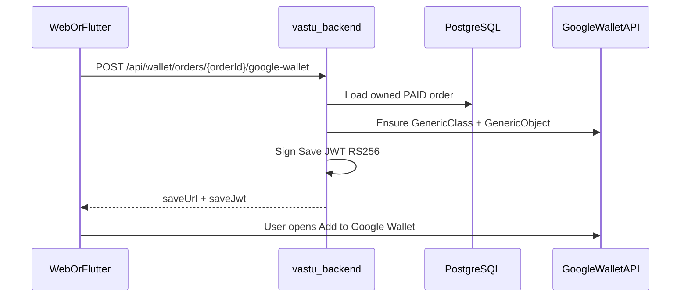

# Google Wallet — Order Receipt Passes

Vastu issues one **Generic** Google Wallet pass per **PAID product order** (purchase receipt). All Google credentials and JWT signing stay on the backend.

## Architecture



## Prerequisites

1. Create an issuer account in the [Google Pay & Wallet Console](https://pay.google.com/business/console).
2. In Google Cloud Console, enable the **Google Wallet API**.
3. Create a service account and download a JSON key.
4. In the Wallet Console, invite the service account email with **Developer** access.
5. Demo mode works for testing; request **publishing access** before public production.
6. Use official [Add to Google Wallet button assets](https://developers.google.com/wallet/generic/resources/brand-guidelines).

## Environment variables

| Variable | Description |
|----------|-------------|
| `GOOGLE_CLOUD_PROJECT_ID` | GCP project id |
| `GOOGLE_WALLET_ISSUER_ID` | Issuer id from Wallet Console |
| `GOOGLE_SERVICE_ACCOUNT_EMAIL` | Service account email |
| `GOOGLE_SERVICE_ACCOUNT_PRIVATE_KEY` | PEM private key (`\n` escaped newlines OK) |
| `GOOGLE_WALLET_CLASS_SUFFIX` | Class id suffix (default `vastu_order_receipt`) |
| `GOOGLE_WALLET_ORIGINS` | Comma-separated allowed web origins for Save JWT |
| `GOOGLE_WALLET_LOGO_URI` | Optional logo URL on the pass |
| `GOOGLE_WALLET_HEX_BG` | Optional hex background (default `#1B4332`) |
| `GOOGLE_WALLET_USE_MOCK` | `true` to use in-memory mock (local/dev without GCP) |

Never put these values in Flutter, web, or Git.

## API (user)

All routes require `Authorization: Bearer <access_token>`.

| Method | Path | Purpose |
|--------|------|---------|
| GET | `/api/wallet/passes` | List my passes |
| GET | `/api/wallet/passes/:id` | Pass detail |
| GET | `/api/wallet/orders/:orderId` | Pass for an order |
| POST | `/api/wallet/orders/:orderId/google-wallet` | Ensure Google object + return `saveUrl` / `saveJwt` |
| POST | `/api/wallet/passes/:id/google-wallet/refresh` | Re-issue save JWT |

Response shape:

```json
{
  "success": true,
  "data": {
    "saveUrl": "https://pay.google.com/gp/v/save/...",
    "saveJwt": "...",
    "objectId": "ISSUER.order_...",
    "classId": "ISSUER.vastu_order_receipt",
    "status": "ACTIVE",
    "pass": { }
  }
}
```

Error codes: `WALLET_PASS_NOT_FOUND`, `ORDER_NOT_FOUND`, `ORDER_NOT_PAID`, `GOOGLE_WALLET_UNAVAILABLE`, `GOOGLE_WALLET_ERROR`.

## API (admin)

| Method | Path | Purpose |
|--------|------|---------|
| GET | `/api/admin/wallet/passes` | List / filter passes |
| PATCH | `/api/admin/wallet/passes/:id` | `{ "status": "ACTIVE" \| "INACTIVE" }` |
| GET | `/api/admin/wallet/passes/:id/events` | Audit events |
| POST | `/api/admin/wallet/passes/:id/google-wallet/reissue` | Support reissue |

## Lifecycle

1. Order becomes `PAID` (Razorpay verify, UPI completion, or POS cash) → soft-create `WalletPass` (`PENDING`).
2. User taps **Add to Google Wallet** → backend creates/gets Generic object (idempotent id `ISSUER.order_{uuidWithoutDashes}`) and returns Save URL.
3. Admin can deactivate / reactivate; events are stored in `WalletEvent`.

## Local testing without Google

```bash
GOOGLE_WALLET_USE_MOCK=true
```

Issue endpoint returns a mock `saveUrl`. Real Google save will not work until credentials and issuer setup are complete.

## Migration

```bash
bunx prisma migrate deploy
# or during development:
bunx prisma migrate dev
```

Migration: `prisma/migrations/20260904120000_add_google_wallet_passes`.

## Clients

- **Web:** payment success page + `api/wallet.ts`
- **Flutter:** My Orders / order confirmation + `WalletRemoteDataSource`
- **Admin:** Remidies → Wallet (`#/remidies/wallet-passes`)
